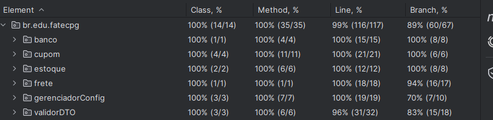

# Cobertura de Testes

Aqui você pode ver um exemplo de cobertura de testes em um projeto Java usando o JUnit e o JACOCO.

**Tarefa 1: Módulo de Cálculo de Frete**

**Tarefa 2: Validador de Cupom de Desconto**

**Tarefa 3: Controle de Estoque de Produtos**

**Tarefa 4: Processador de Transações Bancárias**

**Tarefa 5: Validador de DTO (Data Transfer Object) de Inscrição**

**Tarefa 6: Serviço de Gerenciamento de Configuração da Aplicação**

